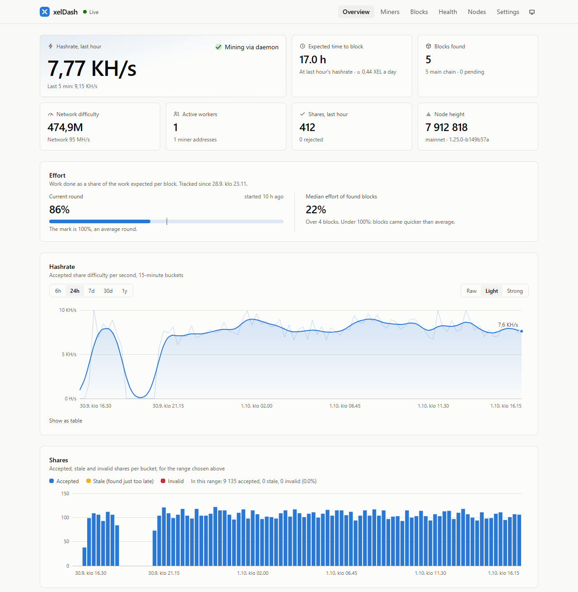
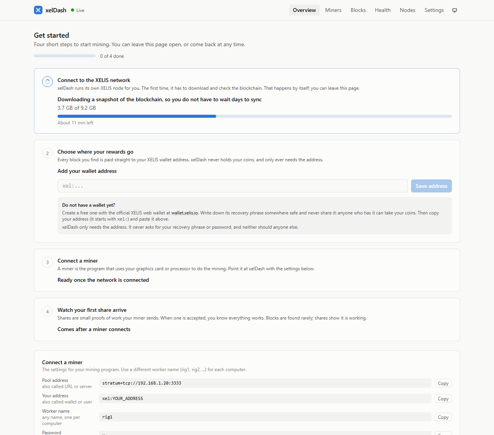
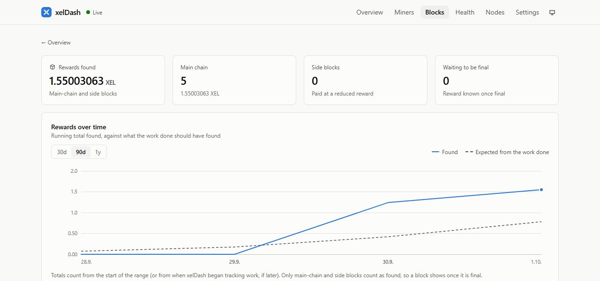
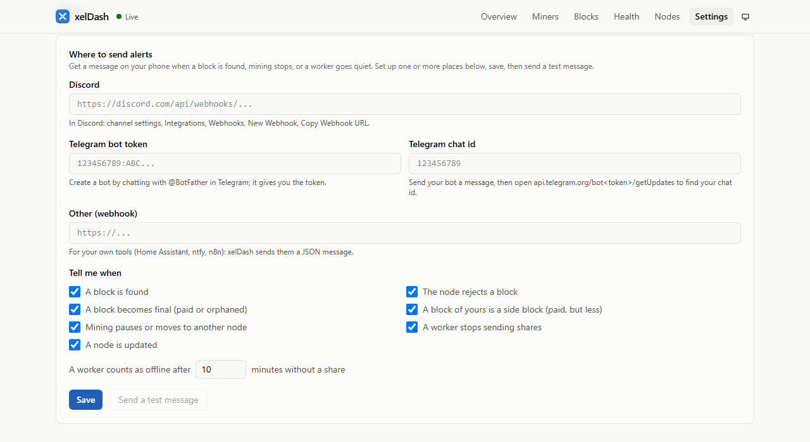
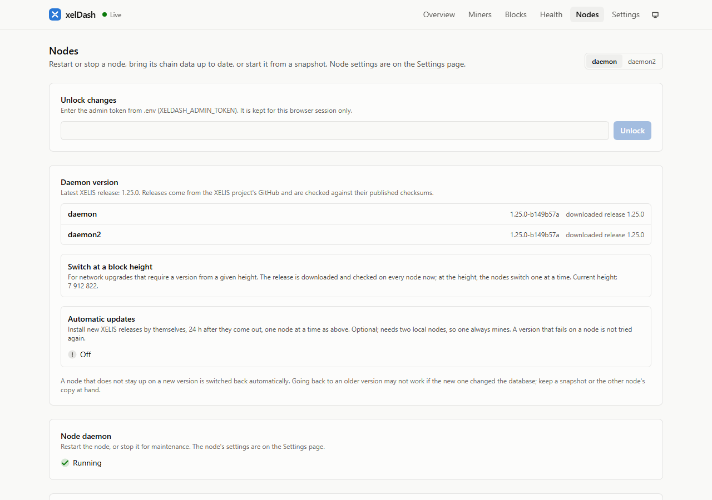
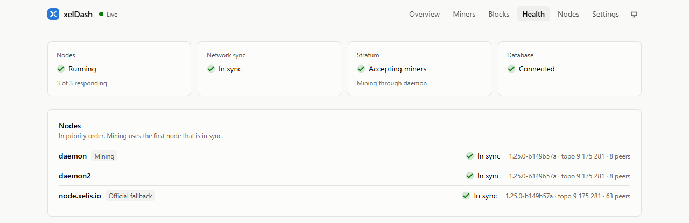
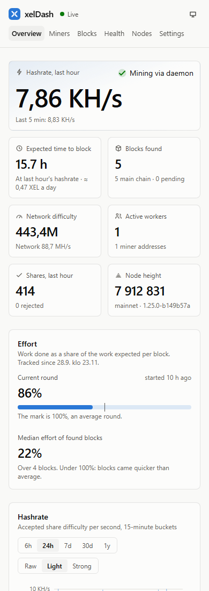
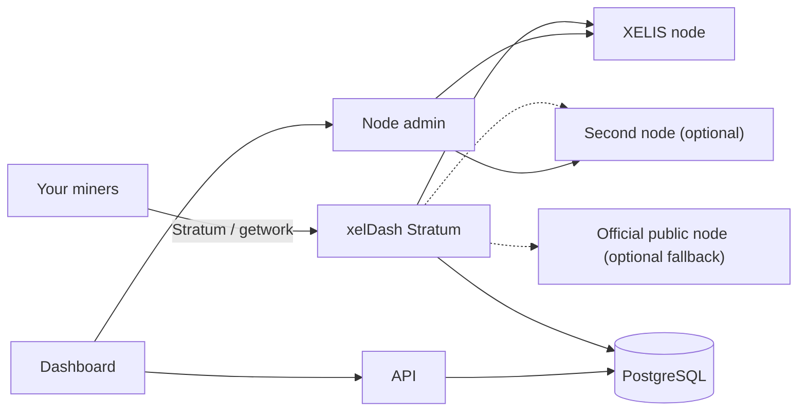

  

<h1 align="center">xelDash</h1>

  <b>Self-hosted XELIS solo mining, with the statistics of a pool.</b> 
  Your node. Your miners. Your rewards. And a dashboard that shows exactly how it is going.

  
  
  
  

  <a href="#features">Features</a> ·
  <a href="#screenshots">Screenshots</a> ·
  <a href="#how-it-works">How it works</a> ·
  <a href="#quick-start">Quick start</a> ·
  <a href="docs/README.md">Documentation</a>

  <picture>
    <source media="(prefers-color-scheme: dark)" srcset="docs/images/overview-dark.png">
    
  </picture>

xelDash runs your own XELIS node, a mining server for your rigs, and a live dashboard, all
together with Docker Compose. Point your miners at it and every share is checked and counted,
so you see per-rig hashrate, rejected shares, luck and expected earnings, the way a pool would
show them.

It is **solo mining**: when one of your rigs finds a block, the reward goes straight to that
rig's own XELIS address. There is no pool, no fee, no balance and no wallet inside xelDash. It
holds no funds, ever.

## Why xelDash

- **Made for beginners.** No node or wallet experience needed: a one-step installer, a guided
  setup in the dashboard, plain-language help, and a link to the official XELIS web wallet if you
  need an address.
- **You keep everything.** Blocks are found on your own node and pay your own address.
- **You see everything.** Pool-grade statistics for a setup that is entirely yours.
- **It keeps mining.** A second node, an optional fallback to the official public node, and
  upgrades that go one node at a time mean restarts and new releases do not stop your rigs.
- **It is quick to run.** One `docker compose up`, on a machine on your LAN.

## Features

### Easy to start

- **One-step installer.** Double-click `xeldash.cmd` on Windows, or run `./xeldash.sh` on macOS
  and Linux. It checks Docker, makes the passwords, picks the real XELIS network with the fast
  snapshot start, builds and starts everything, and opens the dashboard.
- **A guided setup in the dashboard.** Four steps with a progress bar and time left while your
  node downloads the blockchain, then your wallet address, then your first miner, then your
  first share. Every step says what it is and why.
- **Your address, checked by your own node.** Paste it and xelDash tells you plainly if it has a
  typo or belongs to the wrong network. No wallet yet? It links to the official XELIS web wallet
  ([wallet.xelis.io](https://wallet.xelis.io)). xelDash never handles wallets, recovery phrases
  or coins.
- **Copy-ready miner settings.** Your server's real address and port, your wallet address, and a
  ready-made command for each miner, each with a copy button. Common Stratum miners that send
  `address.worker` as their user name work too.
- **Plain language.** A short glossary, "it does not connect, what now?" tips, and a
  `xeldash lan on` command that opens xelDash to your home network safely.

  <picture>
    <source media="(prefers-color-scheme: dark)" srcset="docs/images/setup-dark.png">
    
  </picture> 
  The setup guide during a first install (sample values).

### Mining

- **Stratum and getwork.** Stratum (`xel/v3`) for GPU and CPU miners such as Rigel, optional
  Stratum over TLS, and getwork for the official `xelis_miner`.
- **Every share is validated** with the official XELIS Hash V3 code, so the numbers you see
  are real.
- **Difficulty that fits each rig.** Automatic per-connection tuning, or a fixed value from
  the miner's password (`d=50000`).
- **Fair to fast GPUs.** Shares that arrive just after a new block still count, so 5-second
  blocks do not waste your hashrate.
- **Per-address work.** Each miner mines to its own address; rewards never touch xelDash.

### Dashboard

- **Live overview:** hashrate, expected time to a block, network difficulty, workers, shares
  and node health, updating as it happens.
- **Effort and luck.** See how far the current round is from an average block, and how the
  blocks you found compare. Recorded per share against the difficulty of the moment, so it
  stays true as the network changes.
- **Expected earnings** in XEL, and optionally in money with the XEL price in one of eleven
  currencies. Prices are fetched by your server, never by your browser.
- **Smooth, honest charts** from six hours to a year, with adjustable smoothing and the raw
  data kept behind the line, and a shares chart that shows accepted, stale and invalid shares.
- **Miners and workers** with per-rig hashrate, the hashrate each miner reports about
  itself, rejected shares by reason, and a clean list that hides rigs that went away.
- **A notice, and an optional chime,** when one of your miners finds a block.
- **Blocks** with their final status, reward and the effort of the round that found them, a link
  to each in the official block explorer, and the total rewards found so far.
- **Light, dark or system theme**, and a layout that works on a phone.

### Nodes that look after themselves

- **Two local nodes** with automatic failover and failback, and an **optional fallback to the
  official public node**. Mining pauses only when nothing can issue work, and resumes by
  itself.
- **Everything from the dashboard:** restart, stop and start each node; change any daemon
  setting, with plain-language explanations for the important ones; set trusted peers.
- **Snapshots:** download the official daily mainnet snapshot, or drop your own zip onto the
  page. Copy one node's chain into the other in minutes instead of syncing for days.
- **Daemon upgrades:** pick an official XELIS release and xelDash installs it one node at a
  time, checking it against the published checksums, waiting for each node to catch up, and
  rolling back a node that does not stay up.
- **Network upgrades on schedule:** switch at a specific block height for hard forks.
- **Optional automatic updates** for setups with two local nodes.

### Stay informed

- **Alerts** to Discord, Telegram or any webhook, set up on the Settings page with a test
  message: blocks found, side blocks and final blocks, mining paused or resumed, workers
  offline, and node updates started, finished or failed.
- **Connection help:** when a miner cannot connect (wrong address, wrong network, not on your
  network), the dashboard says why and what to change.
- **Events** for everything that happens to your nodes, on the dashboard.
- **Optional daily database backups.**

### Safe by default

- Listens on `127.0.0.1` until you open it to your LAN, and then accepts miners and dashboard
  visitors only from your own networks (on Windows, with firewall rules that block the internet).
- The database sits on an internal network that only the API and Stratum can reach.
- Changes to your nodes need an admin token, sent in a header, and nothing in xelDash can
  control Docker.
- Strict content security policy, per-IP limits and bans for abusive clients, checked snapshots
  and release downloads, and an optional HTTPS front with a login.

See [Security](docs/SECURITY.md) for what is protected and what is not.

## Screenshots

<table>
  <tr>
    <td width="50%">
      <picture>
        <source media="(prefers-color-scheme: dark)" srcset="docs/images/blocks-dark.png">
        
      </picture>
      
<b>Blocks:</b> rewards found, and how that compares with the work done

    </td>
    <td width="50%">
      <picture>
        <source media="(prefers-color-scheme: dark)" srcset="docs/images/alerts-dark.png">
        
      </picture>
      
<b>Alerts:</b> set up from the dashboard, with a test message

    </td>
  </tr>
  <tr>
    <td width="50%">
      <picture>
        <source media="(prefers-color-scheme: dark)" srcset="docs/images/nodes-dark.png">
        
      </picture>
      
<b>Nodes:</b> versions, upgrades, restart, copy, snapshots

    </td>
    <td width="50%">
      <picture>
        <source media="(prefers-color-scheme: dark)" srcset="docs/images/health-dark.png">
        
      </picture>
      
<b>Health:</b> every node and the mining status

    </td>
  </tr>
</table>

   
  The same dashboard on a phone

## How it works

Miners connect to xelDash's Stratum server. It asks your node for a block template for each
miner's own address, checks every share against it, and records the results. Only when a share
also meets the network's difficulty does it submit a block, to your node, before anything else
happens. The dashboard reads the recorded statistics, and a small admin service does the node
management. Details are in the [architecture guide](docs/ARCHITECTURE.md).

## Quick start

1. Install **Docker Desktop** (Windows or macOS) or Docker Engine (Linux).
2. Download xelDash (**Code → Download ZIP**) and unzip it.
3. **Windows:** double-click `xeldash.cmd`. **macOS and Linux:** run `./xeldash.sh` in a terminal.

The dashboard opens and guides you through the rest. You do not need a wallet before you start.

The [getting started guide](docs/GETTING-STARTED.md) explains every step for complete beginners,
including installing Docker and getting a wallet address, and has the manual setup for advanced
users. [Connecting miners](docs/MINERS.md) has the settings for each kind of miner.

## Status

xelDash is feature-complete for a first release and has been run on XELIS mainnet with two
nodes, failover, rolling and scheduled upgrades, and a GPU mining through it. What remains
before a tagged 0.1.0 is testing with more mining programs, and automated tests. Rigel and the
official `xelis_miner` are tested; others should work but are not verified yet. The Windows
installer has been run end to end; the macOS and Linux launcher has not yet been tried on those
systems. The
[pre-release testing list](docs/PRE-RELEASE-TESTING.md) says what is still unverified.

## Documentation

Everything else lives in [docs/](docs/README.md):

| | |
|---|---|
| [Getting started](docs/GETTING-STARTED.md) | Install, configure, first run |
| [Connecting miners](docs/MINERS.md) | Settings for Rigel, SRBMiner, `xelis_miner` and others |
| [Operations](docs/OPERATIONS.md) | Alerts, backups, HTTPS, snapshots, second node, upgrades |
| [Security](docs/SECURITY.md) | The model, the protections, the remaining risks |
| [Architecture](docs/ARCHITECTURE.md) | Services, protocols, data model |

## Built with

Node.js and PostgreSQL for the services, React, Vite and Tailwind for the dashboard, and the
official XELIS daemon and [XELIS Hash V3](https://github.com/xelis-project/xelis-hash) code
(compiled into a small Rust addon) for validation. Images are built for amd64 and arm64.

## Contributing

Bug reports, miner compatibility reports and pull requests are welcome. See
[CONTRIBUTING.md](CONTRIBUTING.md). Changes are listed in the [changelog](CHANGELOG.md).

## License

[MIT](LICENSE). The XELIS Hash V3 code built into the Stratum image comes from
[xelis-project/xelis-hash](https://github.com/xelis-project/xelis-hash), also MIT.

xelDash is a community project and is not an official XELIS product.
